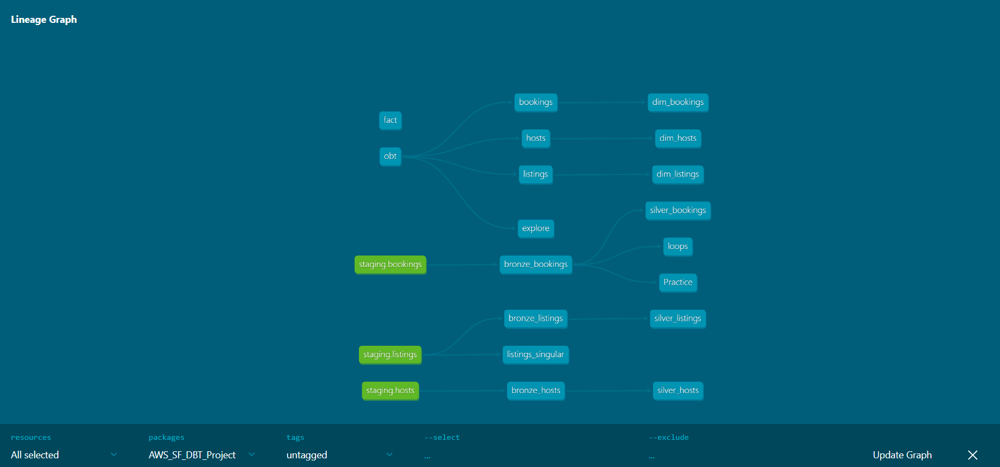
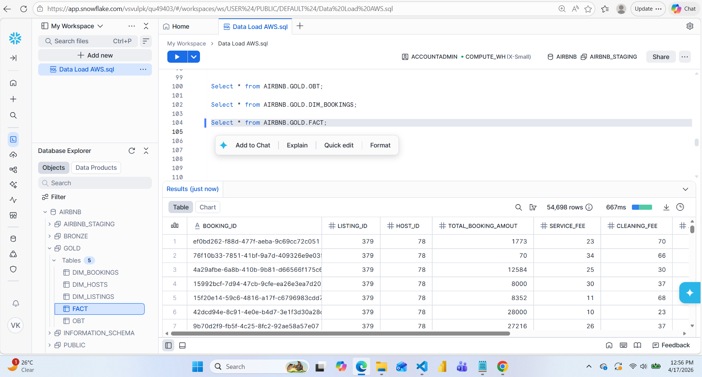

# Airbnb Data Engineering Pipeline (AWS + Snowflake + dbt)

## 🚀 Project Overview

This project demonstrates an end-to-end data engineering pipeline built using AWS, Snowflake, and dbt.

The pipeline processes Airbnb listing data and transforms raw data into analytics-ready datasets using the Medallion Architecture (Bronze, Silver, Gold).

It simulates a real-world data engineering workflow including data ingestion,increamental load, transformation, modeling, and data quality validation.

---

## 🏗 Architecture

AWS S3 → Snowflake (Raw Layer) → dbt (Transformations) → Analytics Layer

### Flow:

1. Raw data is stored in AWS S3
2. Snowflake loads data using external stages
3. dbt transforms data into structured models
4. Final data is used for analytics/reporting
---

## ⚙️ Tech Stack

* AWS S3 (Data Storage)
* Snowflake (Cloud Data Warehouse)
* dbt (Data Transformation & Modeling)
* SQL (Data Processing)
* GitHub (Version Control)
---

## 📊 Data Pipeline

### 1. Data Ingestion

* Airbnb dataset uploaded to AWS S3
* Snowflake external stage created using IAM role

### 2. Data Loading

* Data loaded into Snowflake using COPY INTO command

### 3. Data Transformation (dbt)

* Bronze Layer: Raw data ingestion
* Silver Layer: Cleaned and standardized data
* Gold Layer: Aggregated business-level metrics

---

## Data Modeling (Medallion Architecture)

* Bronze: Raw tables from source
* Silver: Cleaned & transformed data
* Gold: Business-level aggregations and metrics

---

## dbt Features

* dbt models for transformation
* Source configuration
* Added Increamental Model
* Schema.yml for tests
* Data quality tests (not_null, unique)
* Jinja templating for dynamic SQL
* Modular SQL transformations
---

## How to Run

1. Clone the repository
2. Configure dbt profile
3. Run:
   dbt run
4. Test:
   dbt test

---

## Key Learnings

* Built end-to-end ELT pipeline
* Implemented Medallion Architecture
* Used dbt for modular transformations
* Integrated AWS S3 with Snowflake
* Applied data quality testing using dbt

---

## Future Improvements

* Implement CI/CD pipeline
* Add orchestration using Airflow
* Enhance data quality checks

## 📸 dbt DAG

## 📸 Snowflake Output

